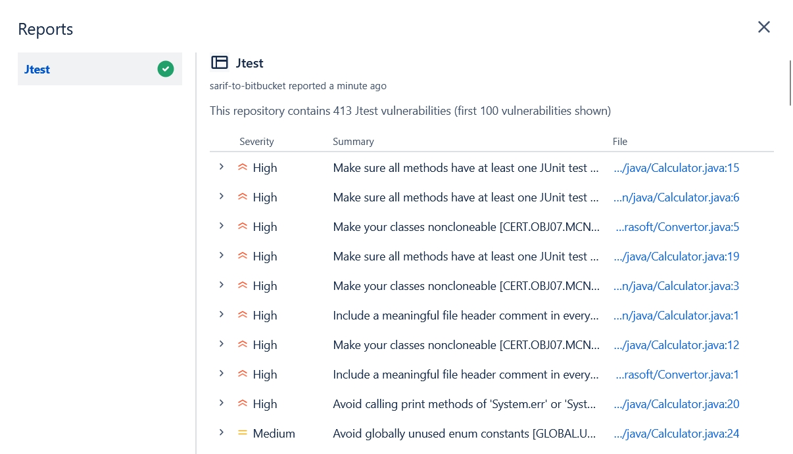

# Sarif to BitBucket Demo

## Getting Started
BitBucket Configuration:

Create Repository Variables `BB_USER` and `BB_APP_PASSWORD` corresponding to a username / app password with BitBucket API access

## Usage in BitBucket Pipeline
```
image: atlassian/default-image:5

pipelines:
  pull-requests:
    '**': # any source branch 
      - step:
          name: "Use sarif-to-bitbucket-demo to upload sarif report to Bitbuckets"
          script:
            # Add Java environment
            - apt update
            - apt install openjdk-17-jdk -y
            - update-alternatives --install "/usr/bin/java" "java" "$JAVA_HOME/bin/java" 1
            
            # Clone and install demo
            - git clone https://github.com/jchen-parasoft/sarif-to-bitbucket-demo.git
            - cd sarif-to-bitbucket-demo
            - npm install
            - node dist/index.js --report "example_reports/parasoft/static/cpptest-std.xml"
```

## Parameters
| Input    | Description                                                               |
|----------|---------------------------------------------------------------------------|
| `report` | Path or minimatch pattern to locate Parasoft static analysis report file. |

## Reports in BitBucket Pipeline
